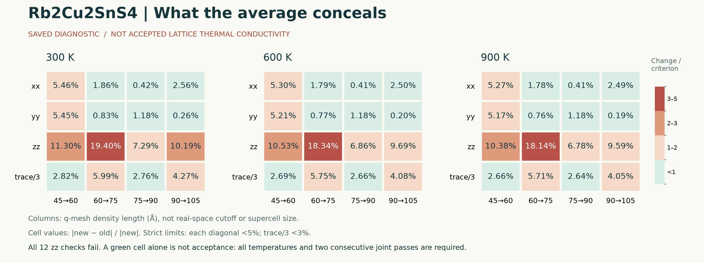

# Rb 网格变化：平均值掩盖了什么

本图重算保存审计的 4 次网格转换 × 3 个温度 × 4 个量，共 48 个变化率，并逐项与审计记录交叉核对。不是新的 κL 求解，也没有重新验证远端 HDF5。



- 12 项 `zz` 检查全部失败；`trace/3` 单项却有 6 项小于 3%。因此只看平均值可能过早认为网格足够。
- 45→60 Å 时 `yy` 下降，`xx/zz` 上升，平均变化含有抵消；75→90 Å 时三者都上升，但 `zz` 的变化被另外两个较小变化稀释。两种情况均不能用平均值替代逐分量检查。
- 绿色只表示某一分量的一次变化小于既有门槛。整体规则仍要求逐温度、逐对角和平均同时满足，并且两次连续转换通过；本图没有任何整体通过。
- 这些是固定历史力模型下的**数值响应方向差异**，不是已收敛材料各向异性的证明，也不是总物理误差条。
- q 网格密度参数用 Å 表示；不能读成超胞长度或 FC3 截断。分母严格为当前更密网格值。

数据：[48 行 CSV](component_changes.csv)、[来源哈希与摘要](summary.json)。导出：[SVG](rb_component_changes.svg)、[PNG](rb_component_changes.png)。非对角项接近数值零，本图不对其计算相对变化。

从仓库根目录运行（Python 需 matplotlib/numpy）：

```bash
python3 experiments/phonon_research_sandbox/analysis/rb_component_diagnostics/build_diagnostics.py
```

脚本直接读取保存的审计 JSON，交叉核对公式和 joint verdict，然后生成图与表。它不会连接网络或调用 phono3py。容差 `1e-13` 仅用于同一浮点公式的复算一致性，不是科研验收门槛。

科学标准来源是 [`run_postprocess_firstpass.py`](../../../../thermo_candidates/Rb2Cu2SnS4/phono3py/run_postprocess_firstpass.py) 中的现有 Rb 规则，未新增或放宽标准。
